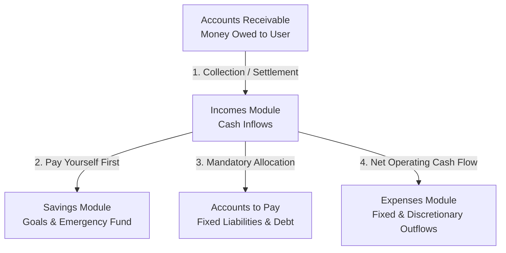
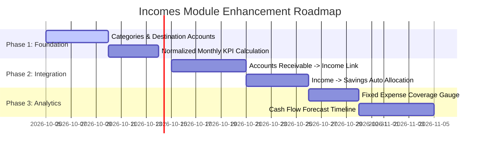

# 📈 Financial Analysis & Strategic Improvement Plan: Incomes Module

> **Role & Perspective:** Senior Financial Analyst & FinTech UI/UX Product Architect  
> **Target Application:** Personal Finance Web Management Suite  
> **Date:** October 2026  

---

## 📋 1. Executive Summary & Current State Review

The current **Incomes Flow** provides a solid baseline for basic income record-keeping. It includes live searching, multi-criterion inline filtering (frequency, status, date), dual-currency support (`HNL` / `USD`), tag-based metadata, and a total received KPI metric.

However, from a **professional financial analysis** perspective, treating income purely as isolated records misses critical cash-flow insights and inter-module synergies. In personal financial management, **Income is the engine of the entire ecosystem** — it feeds *Savings*, covers *Accounts to Pay* (liabilities), offsets *Expenses* (fixed and variable), and resolves *Accounts Receivable*.

---

## 🏛️ 2. Core Financial Ecosystem Connections

To build a state-of-the-art personal finance platform, the **Incomes Module** must function in direct harmony with the other 4 financial modules:

### Key Inter-Module Synergies:
1. **Accounts Receivable $\rightarrow$ Incomes**:
   - When a client or debtor settles a receivable, it should seamlessly transition into a **Realized Income Entry** (or automatically link to it) without requiring manual double entry.
2. **Incomes $\rightarrow$ Savings (Automated "Pay Yourself First")**:
   - Financial best practice dictates allocating 10%–20% of any incoming revenue directly to savings goals before spending. The Income creation/settlement flow should offer an optional "Auto-allocate % to Savings Target".
3. **Incomes $\rightarrow$ Accounts to Pay (Fixed Overhead Reserve)**:
   - Income should automatically compute the **Committed Overhead Ratio** — showing how much of an incoming payment is already pledged to upcoming bills and debt service.
4. **Incomes $\rightarrow$ Expenses (Net Cash Flow Velocity)**:
   - Real-time comparison between **Normalized Monthly Inflow** vs. **Monthly Burn Rate** (Fixed Expenses + Average Discretionary Expenses).

---

## 🔍 3. Identified Gaps in Current Model

| Current Model Attribute | Financial Limitations | Strategic Solution |
| :--- | :--- | :--- |
| **Flat `amount` Field** | Does not distinguish Gross Salary from Net Received (after taxes, health insurance, social security). | Add optional **Gross Amount & Deductions Breakdown**. |
| **No Income Categories** | Cannot analyze income stream diversification (e.g., Salary vs Freelance vs Dividends). | Introduce **Income Categories & Types** (Active, Passive, Portfolio, Windfall). |
| **Static `dateToReceive`** | Conflates expected scheduled date with actual cash settlement date. | Separate **Expected Date** from **Realized Clearing Date**. |
| **Raw Totals in KPIs** | Summing weekly, bi-weekly, and annual incomes directly causes distorted monthly metrics. | Compute **Normalized Monthly Income** (converting all frequencies to monthly equivalent). |
| **Isolated Transactions** | No destination account (e.g. Bank Account, Cash Wallet, Investment Account). | Add **Destination Account Asset Link**. |

---

## 💡 4. Proposed Improvements & Feature Roadmap

### A. Data Model Enhancements (`IncomeItem`)
- **`category`**: `Employment / Salary`, `Freelance / Consulting`, `Investments / Dividends`, `Rental Property`, `Business / Commercial`, `Windfalls / Gifts`.
- **`incomeType`**: `Active` (time-for-money), `Passive` (asset-generated), `Portfolio` (cap gains/dividends), `Windfall` (one-time).
- **`destinationAccount`**: Linked liquid asset account (e.g., *BAC Checking Account*, *Lempiras Wallet*).
- **`grossAmount` & `deductions`**: Optional fields for precise tax & net income tracking.
- **`linkedReceivableId`**: Foreign key pointing to `AccountsReceivable` item when generated from a debt settlement.

### B. Analytical KPIs & Financial Health Indicators
Replace/Supplement simple totals with high-value financial metrics:
1. **Normalized Monthly Cash Inflow**:
   - Converts all frequencies to standard monthly cash flow:
     $$\text{Monthly Rate} = \begin{cases} 
     \text{Amount} \times 4.33 & \text{Weekly} \\
     \text{Amount} \times 2.166 & \text{Bi-weekly} \\
     \text{Amount} & \text{Monthly} \\
     \text{Amount} / 12 & \text{Annual} 
     \end{cases}$$
2. **Fixed Expense Coverage Ratio**:
   $$\text{Coverage Ratio} = \left( \frac{\text{Total Monthly Income}}{\text{Total Fixed Expenses}} \right) \times 100\%$$
   - *Target:* $> 200\%$ (Healthy safety margin).
3. **Income Concentration Risk Index**:
   - Alerts the user if $>80\%$ of total revenue relies on a single income stream.

### C. UI / UX Enhancements
- **Quick Settlement Action**: Single-click "Mark as Cleared Today" action directly on table rows.
- **Cash Flow Horizon Calendar**: Visual timeline showing expected cash inflows over the next 30/60/90 days.
- **Income Diversification Donut Chart**: Visual distribution breakdown by category and income type.
- **Export & Tax Summary Report**: One-click PDF/CSV export formatted for annual tax reporting or financial auditing.

---

## 🗓️ 5. Implementation Phasing Strategy

---

> [!TIP]
> **Financial Analyst Recommendation:**  
> Start with **Phase 1 (Categories & Normalized Monthly Inflow)**. This immediately unlocks meaningful insights on cash flow stability without requiring structural changes to other modules.
